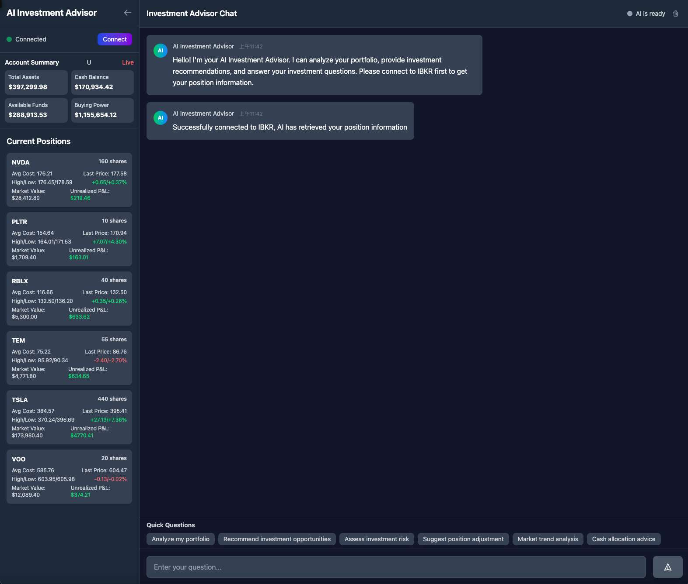

# HelloStockBuy - AI-Powered Investment Platform

<div align="center">
  
</div>

A comprehensive investment platform that combines real-time market data, portfolio management, and AI-powered investment advice. Built with FastAPI, Nuxt.js, and integrated with Interactive Brokers (IBKR) for live trading data. 


## 🚀 Features

### Core Functionality

- **Real-time Market Data**: Live stock prices, charts, and market information
- **Portfolio Management**: Track positions, P&L, and account summary
- **AI Investment Advisor**: ChatGPT-powered investment analysis and recommendations
- **Interactive Brokers Integration**: Direct connection to IBKR for live trading data
- **Multi-language Support**: English and Traditional Chinese interfaces
- **Responsive Design**: Modern, mobile-friendly interface

### Technical Features

- **FastAPI Backend**: High-performance Python API with automatic documentation
- **Nuxt.js Frontend**: Vue.js-based reactive frontend with SSR
- **PostgreSQL Database**: Robust data storage with Alembic migrations
- **Docker Containerization**: Easy deployment and scaling
- **Real-time Updates**: WebSocket support for live data streaming
- **News Integration**: Automated news fetching and sentiment analysis

## 🏗️ Architecture

```
┌─────────────────┐    ┌─────────────────┐    ┌─────────────────┐
│   Frontend      │    │   Backend       │    │   Database      │
│   (Nuxt.js)     │◄──►│   (FastAPI)     │◄──►│   (PostgreSQL)  │
│   Port: 3001    │    │   Port: 8000    │    │   Port: 5432    │
└─────────────────┘    └─────────────────┘    └─────────────────┘
         │                       │
         │                       │
         ▼                       ▼
┌─────────────────┐    ┌─────────────────┐
│   IBKR Gateway  │    │   OpenAI API    │
│   (External)    │    │   (External)    │
└─────────────────┘    └─────────────────┘
```

## 📋 Prerequisites

- Docker and Docker Compose
- Interactive Brokers account (for live trading data)
- OpenAI API key (for AI advisor)
- Node.js 18+ (for local development)
- Python 3.9+ (for local development)

## 🚀 Quick Start

### 1. Clone the Repository

```bash
git clone https://github.com/yourusername/hellostockbuy.git
cd hellostockbuy
```

### 2. Environment Configuration

Copy the example environment file and configure your settings:

```bash
cp .env.example .env
```

Edit `.env` with your configuration:

```env
# Database
POSTGRES_DB=hellostockbuy
POSTGRES_USER=postgres
POSTGRES_PASSWORD=your_password

# IBKR Configuration
IBKR_HOST=127.0.0.1
IBKR_PORT=7497
IBKR_CLIENT_ID=1

# OpenAI Configuration
OPENAI_API_KEY=your_openai_api_key

# Application Settings
DEFAULT_LOCALE=en
FALLBACK_LOCALE=en
```

### 3. Start the Application

```bash
docker compose up -d
```

### 4. Access the Application

- **Frontend**: http://localhost:3001
- **Backend API**: http://localhost:8000
- **API Documentation**: http://localhost:8000/docs

## 🔧 Configuration

### Interactive Brokers Setup

1. Install and configure IBKR Gateway or TWS
2. Enable API connections in the settings
3. Set the correct port (7497 for live, 7496 for paper trading)
4. Update the `IBKR_HOST` and `IBKR_PORT` in your `.env` file

### OpenAI Configuration

1. Get your API key from https://platform.openai.com/
2. Add it to your `.env` file as `OPENAI_API_KEY`

## 📱 Usage

### Main Dashboard

- **Home Page**: Simple navigation to main features
- **AI Investment Advisor**: Chat interface for investment advice
- **Analysis Dashboard**: Detailed portfolio and market analysis

### AI Investment Advisor

1. Connect to IBKR to load your portfolio
2. Ask questions about your investments
3. Get AI-powered analysis and recommendations
4. View real-time portfolio data in the sidebar

### Analysis Dashboard

- View account summary and portfolio positions
- Analyze market data for specific symbols
- Track P&L and performance metrics

## 🛠️ Development

### Local Development Setup

```bash
# Backend
cd backend
python -m venv venv
source venv/bin/activate  # On Windows: venv\Scripts\activate
pip install -r requirements.txt
uvicorn main:app --reload

# Frontend
cd frontend
pnpm install
pnpm dev
```

### Database Migrations

```bash
# Create a new migration
alembic revision --autogenerate -m "Description of changes"

# Apply migrations
alembic upgrade head
```

### Testing

```bash
# Backend tests
cd backend
pytest

# Frontend tests
cd frontend
pnpm test
```

## 📊 API Endpoints

### Core Endpoints

- `GET /connect` - Connect to IBKR
- `GET /account/summary` - Get account summary
- `GET /account/positions` - Get portfolio positions
- `GET /market-data/{symbol}` - Get market data for symbol
- `POST /ai/analyze` - Get AI investment analysis

### News & Data

- `GET /news/all/{symbol}` - Get news for symbol
- `POST /news/fetch-and-store/{symbol}` - Fetch and store news
- `GET /news/stats` - Get news statistics

### Scheduler Control

- `POST /news/scheduler/start` - Start news scheduler
- `POST /news/scheduler/stop` - Stop news scheduler
- `GET /news/scheduler/status` - Get scheduler status

## 🐳 Docker Deployment

### Production Deployment

```bash
# Build and start all services
docker compose -f docker-compose.prod.yml up -d

# View logs
docker compose logs -f

# Stop services
docker compose down
```

### Environment Variables for Production

```env
# Production settings
NODE_ENV=production
PYTHON_ENV=production
POSTGRES_PASSWORD=secure_password
OPENAI_API_KEY=your_production_key
```

## 🔒 Security Considerations

- Store sensitive API keys in environment variables
- Use strong passwords for database access
- Enable HTTPS in production
- Regularly update dependencies
- Monitor API usage and quotas

## 🤝 Contributing

1. Fork the repository
2. Create a feature branch (`git checkout -b feature/amazing-feature`)
3. Commit your changes (`git commit -m 'Add some amazing feature'`)
4. Push to the branch (`git push origin feature/amazing-feature`)
5. Open a Pull Request

### Development Guidelines

- Follow PEP 8 for Python code
- Use ESLint for JavaScript/TypeScript
- Write tests for new features
- Update documentation as needed

## 📝 License

This project is licensed under the MIT License - see the [LICENSE](LICENSE) file for details.

## 🆘 Support

### Common Issues

**IBKR Connection Issues**

- Ensure IBKR Gateway is running
- Check port configuration (7497 for live, 7496 for paper)
- Verify API permissions in IBKR settings

**OpenAI API Issues**

- Verify API key is correct and has sufficient credits
- Check rate limits and usage quotas

**Database Connection Issues**

- Ensure PostgreSQL is running
- Check database credentials in `.env`
- Verify database exists and migrations are applied

### Getting Help

- Check the [Issues](https://github.com/yourusername/hellostockbuy/issues) page
- Create a new issue with detailed information
- Include logs and error messages

## 🗺️ Roadmap

### Upcoming Features

- [ ] Advanced charting with technical indicators
- [ ] Options trading support
- [ ] Mobile app (React Native)
- [ ] Social trading features
- [ ] Advanced portfolio analytics
- [ ] Multi-broker support
- [ ] Real-time notifications
- [ ] Paper trading mode

### Version History

- **v1.0.0** - Initial release with core functionality
- **v1.1.0** - Added AI advisor and news integration
- **v1.2.0** - Enhanced UI and multi-language support

## 🙏 Acknowledgments

- Interactive Brokers for trading data API
- OpenAI for AI capabilities
- FastAPI and Nuxt.js communities
- All contributors and testers

---

**Disclaimer**: This software is for educational and informational purposes only. Trading involves risk, and past performance does not guarantee future results. Always do your own research and consider consulting with a financial advisor before making investment decisions.
